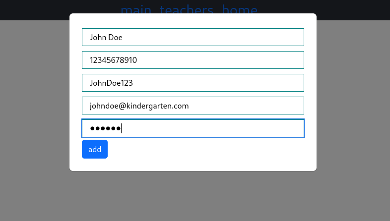
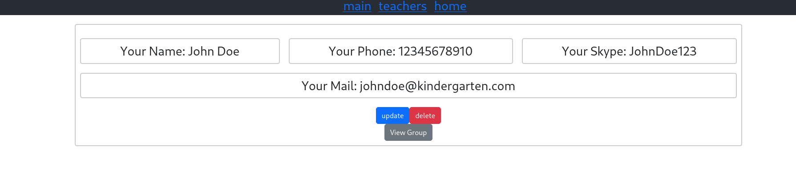
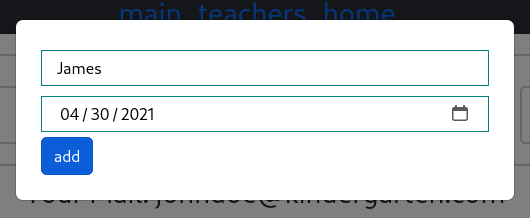
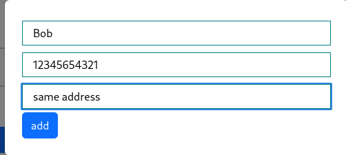
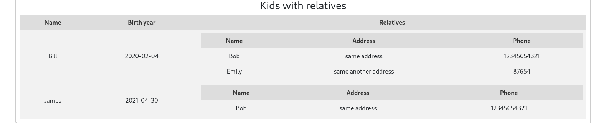
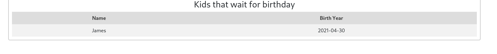
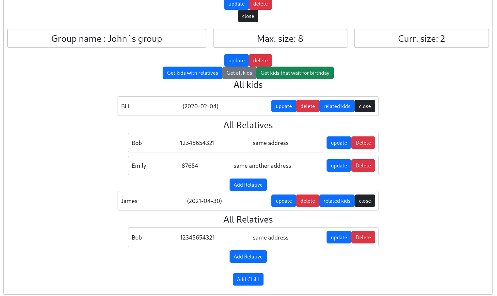
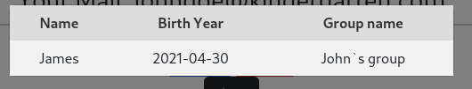
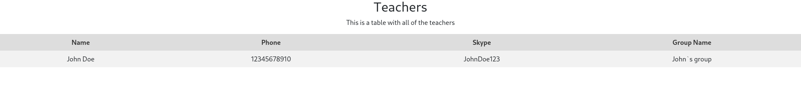
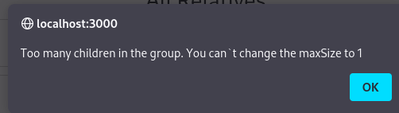

# SecondExam

Description:
--------------
This is a simple kindergarten management system. It allows adding new teachers and viewing a table with teachers and
their groups. Teachers can also modify or delete their own information, modify or delete information about their groups,
view a table with children from their group and their relatives. They also can modify or delete information about
children and children`s relatives, and view a table with children's siblings (related kids having at least one common
relative) and their groups. The system also provides a table with upcoming birthdays of the children.

This is a RESTful Java Spring Boot application that implements the entities Teacher, Group, Child, and Relative. There
is a one-to-one relationship between Teacher and Group, a one-to-many relationship between Group and Child, and a
many-to-many relationship between Child and Relative.

There are "id", "name", "phone", "skype", "role", "email", "password" and "group" fields in Teacher, "id", "name", "
maxSize", "kids" and "teacher" fields in Group, "id", "name", "birthYear", "relatives" and "group" in Child and "id", "
name", "phone", "address" and "kids" in Relative.

The number of children in Group must be less than or equal to maxSize.

If, when adding a relative to a child, a relative with the same fields is found in the db, the existing relative from
the database will be added to the child. Else, a new relative will be added to the child.

If, when updating a child's relative, a relative with the same fields and another id is found in the db, the equal
relative will be added to the child and updated relative will be removed.

For Authentication and Authorization teachers are using JWT-tokens. Access token is used for a authorization and has
short lifetime. Refresh token is used for regenerating access token and has longer lifetime.

Used Technologies:
-------------------

### Back-end:

- Spring Boot
- Spring Web
- Spring Data JPA
- MariaDB
- Lombok
- Spring Security
- java-jwt
- Hibernate Validator
- AssertJ
- Mockito

### Front-end:

- ReactJS

### Server Build:

- Maven

### Client Build:

- npm

Requirements:
-------------

- Java 17
- MariaDB
- Maven

You also must set your database url, password and username to *project directory*
/src/main/resources/application.properties file and to *project directory*
/src/test/resources/application-test.properties

Examples:
---------

  
  
Adding a teacher

  
  
The teachers home page

  
  
Adding a group

  
  
Adding a child

  
  
Adding a relative

  
  
Kids with relatives

  
  
Kids that wait for birthday

  
  <
  
Bill`s siblings

  
  
All teachers with their groups names

  
  
  
Validation error

